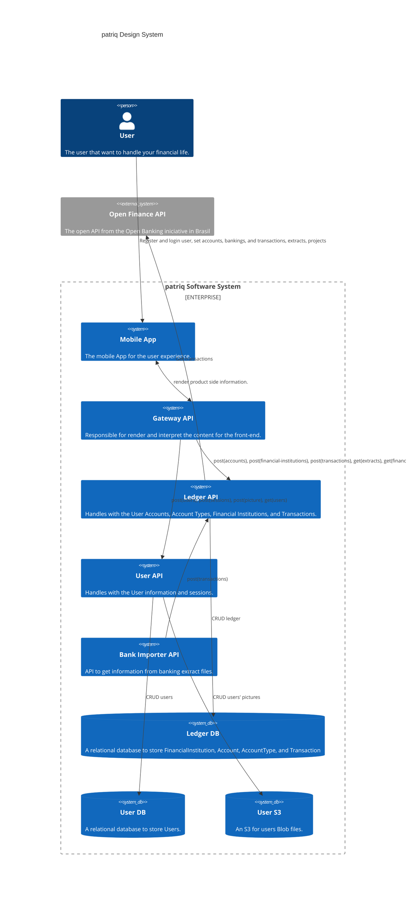
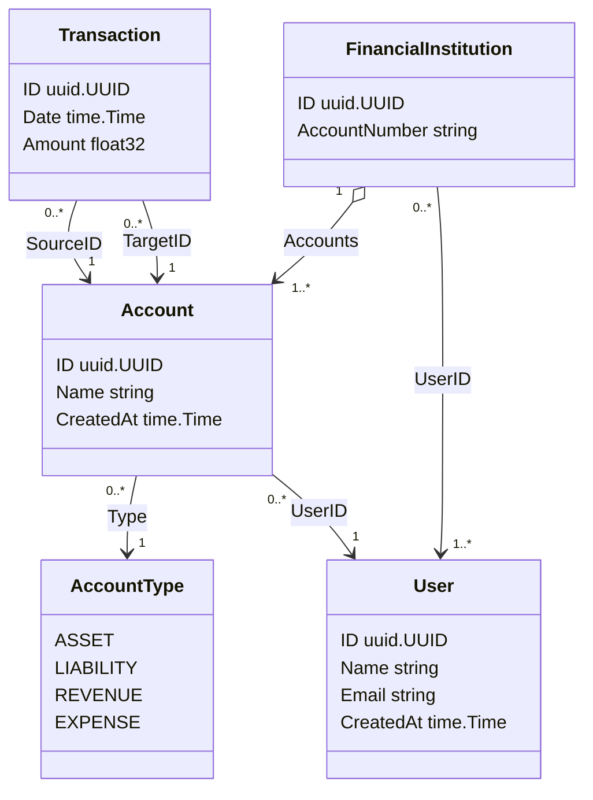

# patriq

## System Design



<!-- SystemQueue(SystemF, "Banking System F Queue", "A system of the bank.")

    Component(C, "CC", "CCzinho")

    BiRel(openFinance, ledgerDb, "Uses")
    Rel(ledger, openFinance, "Sends e-mails", "SMTP") -->

## bank-importer

### Import the bank transactions

```bash
curl -v POST localhost:8080/triggers  -d '
{"basePath":"/Users/fabian.brandao/Documents/patriq/bankimporter/input/",
 "year":2024,
 "month":8,
 "day":1,
 "bank":"nubank",
 "account":"154250440",
 "type":"statement"}'
```
- `type`: 
  - `statement`: the type used for debit extract
  - `invoice`: the type used for credit card extract

## ledger


### Import transactions

```bash
curl -v POST localhost:8080/transactions  -d '
{"sourceId":"d9fb7cd4-f650-4389-819b-b35429dfbfb2",
 "targetId":"262056a2-5f69-4903-8149-f108a8e3b6d9",
 "amount":10.5,
 "date":"2024-09-01T00:00:00"}'
```
