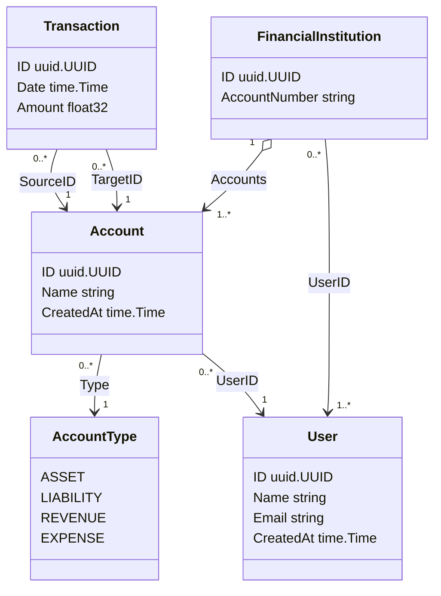

# patriq

## bank-importer

### Import the bank transactions

```bash
curl -v POST localhost:8080/triggers  -d '
{"basePath":"/Users/fabian.brandao/Documents/patriq/bankimporter/input/",
 "year":2024,
 "month":8,
 "day":1,
 "bank":"nubank",
 "account":"154250440",
 "type":"statement"}'
```
- `type`: 
  - `statement`: the type used for debit extract
  - `invoice`: the type used for credit card extract

## ledger


